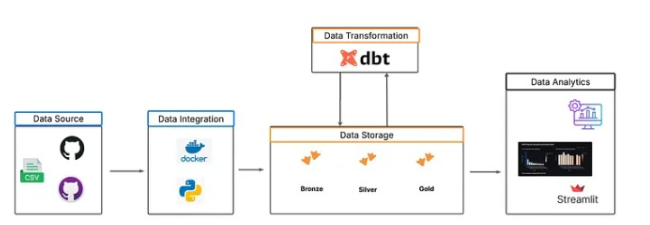
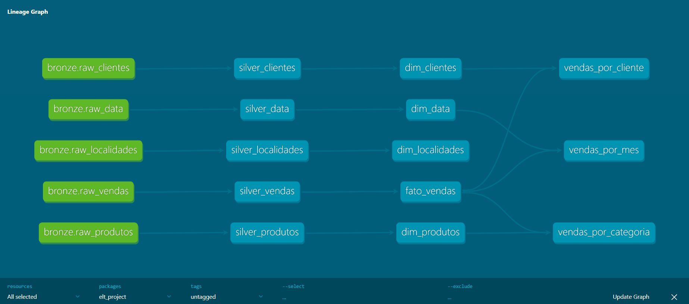
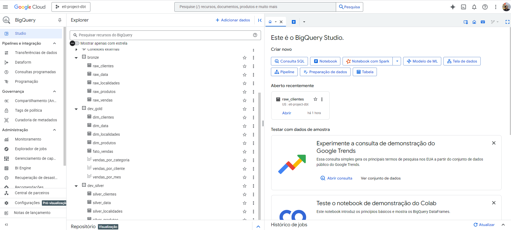
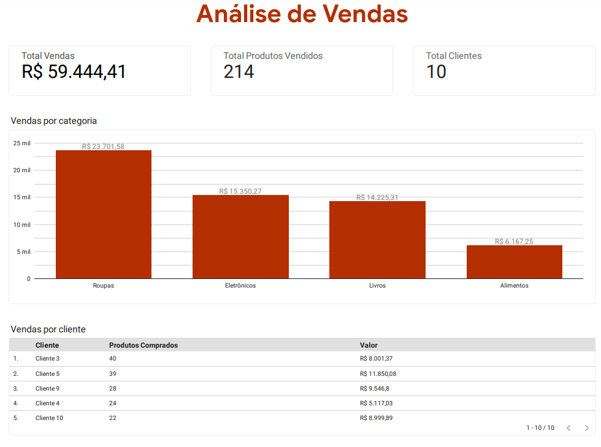

# Analytics Engineering e Linhagem de Dados com Python, DBT, BigQuery e Looker Studio

## Descrição do Projeto
Este projeto é uma solução de ELT (Extract, Load, Transform) que integra Python, dbt e BigQuery para construir um pipeline de dados moderno e escalável.

- **Python** é responsável pela **extração e carga inicial dos dados** a partir de arquivos CSV para o BigQuery, além de realizar automações auxiliares no processo.
- O **dbt (data build tool)** cuida da **transformação e modelagem dos dados**, organizando-os em camadas (Bronze, Silver e Gold).
- O **BigQuery** armazena os dados processados, garantindo performance e escalabilidade.
- O **Looker Studio** é utilizado para visualização, permitindo a criação de dashboards dinâmicos e interativos.

Com essa arquitetura, o projeto resolve o problema de integração, padronização e disponibilização de dados para análise, permitindo que usuários finais (analistas, gestores e equipes de BI) tenham acesso a informações confiáveis de forma rápida e intuitiva.

## Arquitetura do Projeto
A arquitetura do projeto é dividida em três camadas:

- **Bronze**: Esta camada contém os dados brutos extraídos dos arquivos CSV. Os dados são armazenados sem qualquer transformação, servindo como a fonte original.
  
- **Silver**: Nesta camada, os dados são limpos e transformados. Aqui, são realizadas operações de limpeza e preparação, como remoção de duplicatas e formatação de dados.

- **Gold**: A camada final, onde os dados são modelados para análise. Modelos de dados são criados para facilitar relatórios e visualizações, permitindo que os usuários finais acessem informações de forma eficiente.



## Lineage do dbt
Os modelos dbt estão organizados em uma estrutura hierárquica, onde cada modelo é interconectado. A camada Gold contém modelos que dependem dos modelos Silver, que por sua vez dependem dos dados da camada Bronze. Essa organização permite rastrear a origem dos dados e entender como as transformações ocorrem ao longo do processo.



## Tecnologias Utilizadas
- Python
- dbt
- BigQuery
- Looker Studio
- Docker

## Pré-requisitos
Antes de rodar o projeto, você precisará ter instalado/configurado:
- Docker
- Conta no Google Cloud Platform com acesso ao BigQuery
- Chave de serviço (service_account.json) para autenticação
- Git instalado para clonar o repositório

## Como Rodar Localmente
1. **Clone o repositório**:
   ```
   git clone <URL do repositório>
   cd elt_dbt_gcp
   ```

2. **Renomeie o arquivo `.env.example`** para `.env`. Nele está caminho para o arquivo `service_account.json` dentro do container, que será usado pelo script python.

3. **Atualize o nome do project no dbt_project.yml**:
    ```
    project: # Nome do projeto do bigquery aqui
    ```

4. **Construa a imagem Docker**:
   ```
   docker build -t elt_dbt_gcp .
   ```

5. **Inicie o container**:
   ```
   docker run -it elt_dbt_gcp
   ```

6. **Execute os scripts Python**:
   ```
   python src/main.py
   ```

7. **Execute o dbt**:
   ```
   dbt run
   ```

8. **Visualização dos Schemas no BigQuery**:
Após a execução do pipeline, você pode conferir os schemas e tabelas criadas no BigQuery. Isso ajuda a entender como os dados estão organizados em cada camada.



9. **Dashboard Looker Studio**


## Estrutura de Pastas
- **.env.example**: Exemplo de arquivo de configuração de ambiente.
- **Dockerfile**: Instruções para construir a imagem Docker do projeto.
- **requirements.txt**: Lista de dependências Python necessárias para o projeto.
- **README.md**: Documentação do projeto.
- **profiles/**: Contém o arquivo de configuração do dbt e a chave de serviço do Google.
- **data/**: Contém os arquivos CSV utilizados como fonte de dados.
- **src/**: Contém scripts Python para extração e carregamento de dados.
- **dbt_project/**: Contém a estrutura do projeto dbt, incluindo modelos, documentação e testes.

## Boas Práticas e Observações
- A separação em camadas (Bronze, Silver, Gold) facilita a manutenção e a compreensão do fluxo de dados.
- O uso do dbt permite versionar e documentar as transformações de dados, promovendo a colaboração entre equipes.
- É importante manter a documentação atualizada para facilitar a integração de novos membros na equipe.

## Contato
[](https://linkedin.com/in/matheusbnc)
[](https://github.com/matheusbnc)
