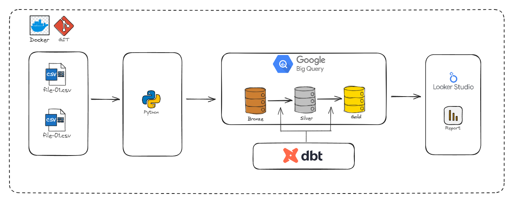

# Analytics Engineering e Linhagem de Dados com Python, DBT, BigQuery e Looker Studio

## Descrição do Projeto
Este projeto é uma solução de ELT (Extract, Load, Transform) que integra Python, dbt e BigQuery para construir um pipeline de dados moderno e escalável.

- **Python** é responsável pela **extração e carga inicial dos dados** a partir de arquivos CSV para o BigQuery, além de realizar automações auxiliares no processo.
- O **dbt (data build tool)** cuida da **transformação e modelagem dos dados**, organizando-os em camadas (Bronze, Silver e Gold).
- O **BigQuery** armazena os dados processados, garantindo performance e escalabilidade.
- O **Looker Studio** é utilizado para visualização, permitindo a criação de dashboards dinâmicos e interativos.

## Arquitetura do Projeto



O projeto adota um fluxo ELT (Extract, Load, Transform) estruturado em três camadas de dados, integrando ferramentas específicas em cada etapa para garantir portabilidade, automação e escalabilidade do pipeline.

| Etapa                   | Descrição                                                                           | Ferramentas / Infraestrutura |
| ----------------------- | ----------------------------------------------------------------------------------- | ---------------------------- |
| **Sources (Bronze)**    | Arquivos CSV contendo os dados brutos, sem transformação.                           | CSV Files                    |
| **Data Ingestion**      | Extração dos dados dos arquivos CSV e carregamento no Data Warehouse.               | Python + Docker              |
| **Data Warehouse**      | Armazenamento dos dados limpos e preparados, permitindo consultas rápidas.          | BigQuery                     |
| **Data Transformation** | Limpeza, transformação e modelagem dos dados, criando tabelas e views para análise. | dbt + Docker                 |
| **Data Visualization**  | Criação de dashboards interativos e análises de KPIs para usuários finais.          | Looker Studio                |

## Camadas de Dados
- **Bronze**: Esta camada contém os dados brutos extraídos dos arquivos CSV. Os dados são armazenados sem qualquer transformação, servindo como a fonte original.
  
- **Silver**: Nesta camada, os dados são limpos e transformados. Aqui, são realizadas operações de limpeza e preparação, como remoção de duplicatas e formatação de dados.

- **Gold**: A camada final, onde os dados são modelados para análise. Modelos de dados são criados para facilitar relatórios e visualizações, permitindo que os usuários finais acessem informações de forma eficiente.

## Lineage do dbt
Os modelos dbt estão organizados em uma estrutura hierárquica, onde cada modelo é interconectado. A camada Gold contém modelos que dependem dos modelos Silver, que por sua vez dependem dos dados da camada Bronze. Essa organização permite rastrear a origem dos dados e entender como as transformações ocorrem ao longo do processo.


## Tecnologias Utilizadas
- Python
- dbt
- BigQuery
- Looker Studio
- Docker

## Pré-requisitos
Antes de rodar o projeto, você precisará ter instalado/configurado:
- Docker
- Conta no Google Cloud Platform com acesso ao BigQuery
- Chave de serviço (service_account.json) para autenticação
- Git instalado para clonar o repositório

## Como Rodar Localmente
1. **Clone o repositório**:
   ```
   git clone <URL do repositório>
   cd elt-project-dbt
   ```

2. **Renomeie o arquivo `.env.example`** para `.env`. Nele está caminho para o arquivo `service_account.json` dentro do container, que será usado pelo script python.

3. **Atualize o nome do project no profiles/profiles.yml**:
    ```
    project: # Nome do projeto do bigquery aqui
    ```

4. **Coloque sua chave do gcp com acesso ao bigquery no arquivo service_account.json**

5. **Construa a imagem Docker**:
   ```
   docker build -t elt_dbt_gcp .
   ```

6. **Inicie o container**:
   ```
   docker run -it elt_dbt_gcp
   ```

7. **Execute os scripts Python**:
   ```
   python src/main.py
   ```

8. **Execute o dbt**:
   ```
   dbt run
   ```

9. **Visualização dos Schemas no BigQuery**:
Após a execução do pipeline, você pode conferir os schemas e tabelas criadas no BigQuery. Isso ajuda a entender como os dados estão organizados em cada camada.


10. **Dashboard Looker Studio**


## Estrutura de Pastas
```
elt_dbt_gcp/
├── .env.example                    # Exemplo de arquivo de configuração de ambiente
├── Dockerfile                      # Instruções para construir a imagem Docker
├── requirements.txt                # Dependências Python do projeto
├── README.md                       # Documentação do projeto
├── profiles/                       # Configuração do dbt e chave de serviço do Google
│   |── service_account.json
│   └── profiles.json
├── data/                           # Arquivos CSV utilizados como fonte de dados
│   └── arquivo_exemplo.csv
├── src/                            # Scripts Python para extração e carregamento de dados
│   ├── main.py
│   └── bigquery_connector.py
└── dbt_project/                    # Estrutura do projeto dbt
    ├── elt_project/models/         # Modelos Silver e Gold
    └── elt_project/dbt_project.yml # Configuração principal do projeto dbt
```

## Boas Práticas e Observações
- A separação em camadas (Bronze, Silver, Gold) facilita a manutenção e a compreensão do fluxo de dados.
- O uso do dbt permite versionar e documentar as transformações de dados, promovendo a colaboração entre equipes.
- É importante manter a documentação atualizada para facilitar a integração de novos membros na equipe.

## Contato
[](https://linkedin.com/in/matheusbnc)
[](https://github.com/matheusbnc)
